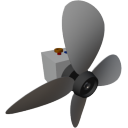

  

|Component|`Propeller`|
|---|---|
|**Module**|`ARCHEAN_propeller`|
|**Mass**|100 kg|
|[**Size**](# "Based on the component's occupancy in a fixed 25cm grid.")|50 x 50 x 50 cm|
#
---

# Description
Propeller 是一种通过旋转叶片产生推力的组件。它用于在空气中或水中推进载具。

# Usage

可以通过按 `V` 键访问的配置界面进行配置。

### Configuration Interface
它提供螺旋桨的信息并允许进行配置。
#### Information
- `Input Voltage`：输入电压，单位为伏特。
- `Power`：功耗，单位为瓦。
- `Thrust`：产生的推力，单位为牛顿。
- `Rotation Speed`：转速，单位为转/秒。
- `Pitch`：归一化螺距角。

#### Configuration
- `Radius`：螺旋桨半径，单位为米。
- `Twist`：螺旋桨扭转角（归一化）。
- `Blades`：叶片数量。

### Energy
Propeller 有一个低压能源端口和一个高压能源端口，允许对供电功率进行不同程度的控制。
### Low-Voltage Energy
在此配置下，螺旋桨最高消耗 50 kW。
#### High-Voltage Energy
在此配置下，螺旋桨最高消耗 500 kW。

### List of inputs
|Channel|Function|Range|
|---|---|---|
|0|Speed|-1.0 to +1.0|
|1|Pitch|-1.0 to +1.0|

### List of outputs
|Channel|Function|Value|
|---|---|---|
|0|Rotation Speed|rot/s|
|1|Thrust|Newtons|
