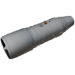

  

|Component|`Turbojet`|
|---|---|
|**Module**|`ARCHEAN_combustion`|
|**Mass**|1000 kg|
|[**Size**](# "Based on the component's occupancy in a fixed 25cm grid.")|400 x 100 x 100 cm|
|**Push/Pull Fluid**|Accept Push|
#
---

# Description
Turbojet 是一种涡轮喷气发动机，通过燃烧液体燃料与环境空气产生推力。
在海平面它最多可产生 **60 kN** 推力，消耗 1.4 kg/s 的十二烷（C12H26）。

# Usage

## 安装
发动机需要：
- 一个将燃料推入其流体端口的泵（它不会自行从储罐中抽取）。
- 启动期间能够提供 **125 kW** 的高压电源。
- 三个数据通道：起动机、点火器和燃料阀。

它没有内部调节：燃料阀直接就是推力控制。

## 启动
1. 起动机置 1：转子转速升至约 24 % N1。起动机运行期间消耗 125 kW。
2. 点火器置 1（400 瓦）并适度打开阀门：燃料一进入燃烧室即开始燃烧。
3. 发动机运转后，可关闭起动机和点火器：火焰自行维持转子旋转。

没有火花时喷入的燃料会在燃烧室内积聚，并在第一次火花时一次性点燃。

> 检查面板显示三个控制的状态以及发动机不运转的原因（起动机无电、阀门关闭、无燃料、无火花、无氧气）。

## 操作
额定推力约在阀门 77 % 处达到；全开时通过的燃料比额定流量多 30 %，燃气温度会超过叶片极限。

火焰只在一定的混合比范围内维持：
- 突然打开阀门会使混合气过浓：压气机喘振（`Surge`）一秒钟，发动机受损。
- 在 45 % N1 以上几乎完全关闭阀门会使混合气过稀：火焰熄灭。

熄火后，只有当转速降到 55 % N1 以下，点火器才能重新点燃火焰。仍然炽热的燃烧室（高于 750 K）无需点火器即可自行点燃燃料。

阀门置 0，火焰熄灭，转子约两分钟后停止。

推力随高度降低。飞行中，速度压缩进气口的空气，但在同等功率下推力减小。

## 极限
- 燃气温度（EGT）高于 **1250 K**：叶片快速磨损。
- N1 高于 **105 %**：转子快速损毁。
- 在 30 % N1 以上吸入水：叶片断裂。
- 燃料污染（水、重质烃）超过 5 %：磨损。原油会磨损发动机。

## 状态
|状态|含义|
|---|---|
|Off|发动机停止。|
|Cranking|起动机驱动转子。|
|Running|正在燃烧。|
|Surge|压气机喘振，混合气过浓。|
|Destroyed|发动机损毁。|

### List of inputs
|Channel|Function|Range|
|---|---|---|
|0|Starter|0 or 1|
|1|Igniters|0 or 1|
|2|Throttle|0.0 to 1.0|

### List of outputs
|Channel|Function|Value|
|---|---|---|
|0|N1|%|
|1|Thrust|Newtons|
|2|EGT|Kelvin|
|3|Running|0 or 1|
|4|Burned fuel flow|kg/s|
|5|Unburned fuel flow|kg/s|
|6|State|"Off", "Cranking", "Running", "Surge", "Destroyed"|
