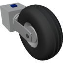

  

|Component|`SmallWheel`|
|---|---|
|**Module**|`ARCHEAN_wheel`|
|**Mass**|20 kg|
|[**Size**](# "Based on the component's occupancy in a fixed 25cm grid.")|25 x 25 x 25 cm|
#
---

# Description
Small Wheel 是一种简单的轮子，只能刹车和转向，没有悬挂系统。
它不需要任何能源即可运行。
# Usage
该轮子可以连接到计算机或其他设备进行控制。

### List of inputs
|Channel|Function|Range|
|---|---|---|
|0|Brake|0.0 to 1.0|
|1|Steer|-1.0 to +1.0|
