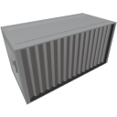

  

|Component|`Container`|
|---|---|
|**Module**|`ARCHEAN_storage`|
|**Mass**|100 kg|
|[**Size**](# "Based on the component's occupancy in a fixed 25cm grid.")|100 x 100 x 200 cm|
|**Push/Pull Item**|Accept Push/Pull|
#
---

# Description
Container 是一种存储组件，容量为 50 个槽位。
它配备了两个端口，用于连接物品管道以接收或发送物品。

数据端口允许使用 [key-value 系统](/xenoncode/documentation.md#key-value-objects) 以字符串形式获取容器内容。

>- *Container 没有从其端口直接拉取或推送物品的能力，它仅是一个存储组件。*

